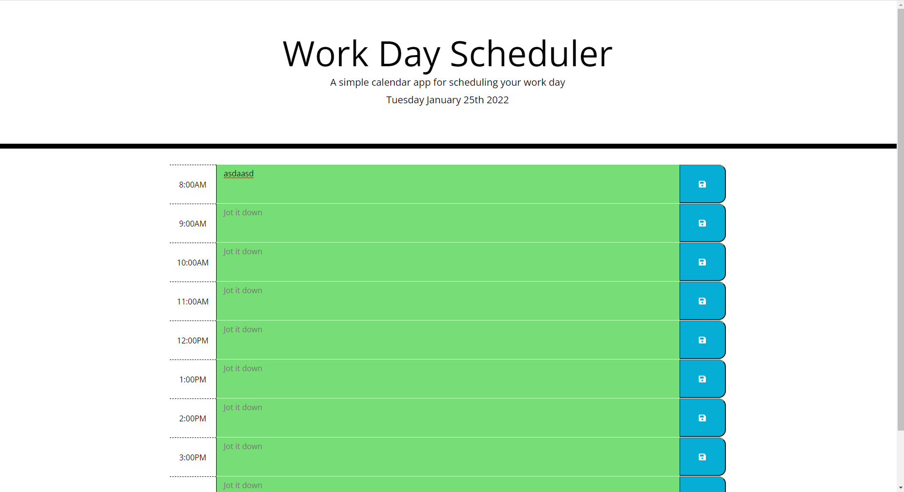

# Day-Scheduler-EK

**Link**

https://elliottpkim.github.io/Day-Scheduler-EK/

I created a simple event calendar for your daily needs powered by Moment.js 
User can save to any hour and it will save data to local storage (hopefully)
Hours will change color according to if current time is past present or future

